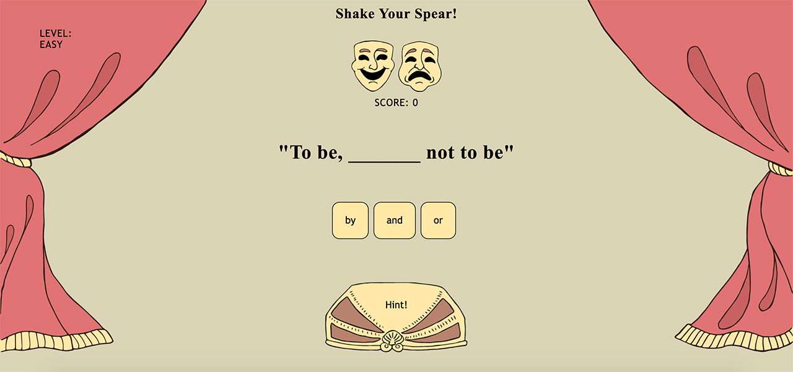

#Shake Your Spear
An entertaining but also sligthly educational game to bring Shakeapeare closer to 21st century people, also showing off the funny, witty face of The Bard.

I created this game as the first project at General Assembly's WDI course.

##Installation and setup
###Run Locally
Download or clone the [Github repo](https://github.com/weresquirrel/wdi-shakespeare-game).
Open index.html in a browser.

###View Online
View on [Heroku](https://whispering-escarpment-91208.herokuapp.com/).

##Technologies used
To create this project I used the following technologies:

* HTML5
* CSS
* Javascript (ECMAScript 6)
* jQuery
* Git
* Github
* Heroku
* Adobe Illustrator

##Challenges Faced
This was my first project as a coder. I made it in one week after only two weeks of learning to code.
Planning the game itself was surprisingly easy. I focused on what the players' expectations would be, which gave me a useful skeleton I could start with and also guided me later on. 

The challenge was the coding part. I think I created too many functions inside functions. I feel unconfident about how to split functions into smaller bits, e.g. the caseCorrect function does far too many things, but everything inside seems to be connected with everything else.

I tried to make the UI responsive, but I wasn't able to manage that, even though I spent ridiculously long time trying.

I think the project represents quite well both my strong and weak points at this moment, hence this is an honest mirror I can use for further self-improvement.

##Where next?

### Improving the UI
The game should be enjoyable on small devices and huge screens as well. Right now it looks nice only on laptops.

Vertically it's a bit bouncy at the bottom. I need a solution without many fixed-sized heights, as that would make it harder to get it working responsively.

Based on user tests, the scoring isn't obvious. I need to make the rules available somewhere, so the players could always check the costs of their actions.

I planned to change the image of the cursor to an actual spear-head. The drawing is in the repo, but alas trying the css trick failed. I have to figure it out.

For some users* it wasn't visually clear that the '_______' in the sentence represents the hole that needs to be filled by one of the choices from below. Maybe there is a better design, that'd make it more intuitive to anyone. 
(* they were not really the target audience, being 10 years old, non-english speakers, and not aware of Shakespeare's works either. However, they are familiar with current UIs, touchscreens and games. If the visuals were intuitive, they would've understood the game mechanics at least).

### Improving the game
I have some plan to add more levels and make the game truly challenging, but I'm not sure if it's necessary. Though it would worth a try or two to fulfill my curiosity.

Sound effects and some renaissance backgroung music could improve the atmosphere of the game.

### Improving the code
At this stage I was simply happy with a working but ugly code. However I know I need to refactor it soon to make it cleaner.
Some specific topics for improvement:

- The handling of levels is hardcoded, it should be easy to add new levels any time.
- I used global variables to share the current state of the game eg. hintBtn onclick handler. I should be able to find a solution with local variables only. 
- I'm not happy with my caseCorrect func, it's extraordinarily long and complicated.
- Check for repetitions (DRY)
- Related to level handling, the worth of the sentences should rather belongs to the levels instead of the individual sentences.
- There are some parts where I was experimenting things and I just commented my progress or versions out, I need to get rid of the unnecessary lines.
